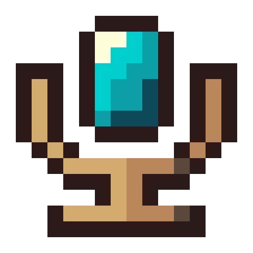

<a id="readme-top"></a>

[![Contributors][contributors-shield]][contributors-url]
[![Forks][forks-shield]][forks-url]
[![Stargazers][stars-shield]][stars-url]
[![Issues][issues-shield]][issues-url]
[![LGPL-3.0 License][license-shield]][license-url]


<br />
<div align="center">
  
  <br />
  

  <p align="center">
    Voice chat for Wynncraft parties, guilds and friends.
    <br />
    <br />
    <a href="https://github.com/DevScyu/WynnVoiceChat/issues/new?labels=bug">Report Bug</a>
    &middot;
    <a href="https://github.com/DevScyu/WynnVoiceChat/issues/new?labels=enhancement">Request Feature</a>
  </p>
</div>


<details>
  <summary>Table of Contents</summary>
  <ol>
    <li><a href="#about-the-project">About The Project</a></li>
    <li><a href="#getting-started">Getting Started</a></li>
    <li><a href="#contributing">Contributing</a></li>
    <li><a href="#license">License</a></li>
    <li><a href="#contact">Contact</a></li>
    <li><a href="#acknowledgments">Acknowledgments</a></li>
  </ol>
</details>


## About The Project

Wynncraft runs no voice server, so installing Simple Voice Chat alone does nothing there.
WynnVoiceChat is a small Fabric client mod plus a relay server: the mod points your existing
Simple Voice Chat installation at the relay, and the relay routes audio between players on
the same Wynncraft world.

Voice is off until you accept the consent screen, and you only hear players who opted in too.
You hear players on your world within range, and only those who chose to be heard by you:
party, friends & guild, or everyone. You can block anyone and report with audio evidence, and
bans are enforced by the relay. There are no accounts: the relay verifies you through Mojang's
session server, the same way a Minecraft server does.

WynnVoiceChat does not replace Simple Voice Chat; you install both.

Built with [![Fabric][fabric-badge]][fabric-url] [![Simple Voice Chat][svc-badge]][svc-url] [![Java][java-badge]][java-url] [![Kotlin][kotlin-badge]][kotlin-url] [![Netty][netty-badge]][netty-url]

<p align="right">(<a href="#readme-top">back to top</a>)</p>


## Getting Started

Three mods go into your `mods` folder, on Minecraft 1.21.11 with Fabric Loader 0.18.4 or newer:

1. [Fabric API][fabric-api-url]
2. [Simple Voice Chat][svc-url] 2.6 or newer
3. The WynnVoiceChat jar from [Modrinth][modrinth-url] or the
   [releases page](https://github.com/DevScyu/WynnVoiceChat/releases)

There is nothing to configure. Join Wynncraft, accept the consent notice, and you are on voice
with your party. `/wvc` lists every command; the terms, community rules and privacy notice are
at [wynnvoicechat.com](https://wynnvoicechat.com).

To build it yourself (JDK 21 toolchain; Gradle itself needs JDK 25 for Fabric Loom):

```sh
git clone https://github.com/DevScyu/WynnVoiceChat.git
cd WynnVoiceChat
./gradlew build
```

The mod is `mod/build/libs/wynnvoicechat-<version>.jar`; the relay is
`server/build/libs/wynnvoicechat-relay-<version>-all.jar`. The build has three modules:
`protocol/` (packets shared by both), `server/` (the Kotlin relay) and `mod/` (the Fabric client mod).

<p align="right">(<a href="#readme-top">back to top</a>)</p>


## Contributing

Contributions are welcome. Fork the repo, make sure `./gradlew build` passes, commit with a
[Conventional Commits](https://www.conventionalcommits.org) subject and open a pull request,
or open an issue with the tag "enhancement". See [CONTRIBUTING.md](CONTRIBUTING.md) and the
[Code of Conduct](.github/CODE_OF_CONDUCT.md).

<p align="right">(<a href="#readme-top">back to top</a>)</p>


## License

Distributed under the GNU Lesser General Public License v3.0 only. See `LICENSE` for more
information.

<p align="right">(<a href="#readme-top">back to top</a>)</p>


## Contact

Discord: [https://discord.gg/QPCwpuA2b](https://discord.gg/QPCwpuA2b)

Project link: [https://github.com/DevScyu/WynnVoiceChat](https://github.com/DevScyu/WynnVoiceChat)

<p align="right">(<a href="#readme-top">back to top</a>)</p>


## Acknowledgments

* [Simple Voice Chat][svc-url], the audio engine this project builds on
* [Contributor Covenant](https://www.contributor-covenant.org)
* [Best-README-Template](https://github.com/othneildrew/Best-README-Template)

WynnVoiceChat is an independent, community-made mod. It is not affiliated with, endorsed by, or part of Wynncraft, Wynntils, or Simple Voice Chat.

<p align="right">(<a href="#readme-top">back to top</a>)</p>


[contributors-shield]: https://img.shields.io/github/contributors/DevScyu/WynnVoiceChat.svg?style=for-the-badge
[contributors-url]: https://github.com/DevScyu/WynnVoiceChat/graphs/contributors
[forks-shield]: https://img.shields.io/github/forks/DevScyu/WynnVoiceChat.svg?style=for-the-badge
[forks-url]: https://github.com/DevScyu/WynnVoiceChat/network/members
[stars-shield]: https://img.shields.io/github/stars/DevScyu/WynnVoiceChat.svg?style=for-the-badge
[stars-url]: https://github.com/DevScyu/WynnVoiceChat/stargazers
[issues-shield]: https://img.shields.io/github/issues/DevScyu/WynnVoiceChat.svg?style=for-the-badge
[issues-url]: https://github.com/DevScyu/WynnVoiceChat/issues
[license-shield]: https://img.shields.io/github/license/DevScyu/WynnVoiceChat.svg?style=for-the-badge
[license-url]: https://github.com/DevScyu/WynnVoiceChat/blob/main/LICENSE
[fabric-badge]: https://img.shields.io/badge/Fabric-1.21.11-DBD0B4?style=for-the-badge
[fabric-url]: https://fabricmc.net/
[fabric-api-url]: https://modrinth.com/mod/fabric-api
[modrinth-url]: https://modrinth.com/mod/wynnvoicechat
[svc-badge]: https://img.shields.io/badge/Simple%20Voice%20Chat-2.6-1E88E5?style=for-the-badge
[svc-url]: https://modrinth.com/mod/simple-voice-chat
[java-badge]: https://img.shields.io/badge/Java-21-ED8B00?style=for-the-badge&logo=openjdk&logoColor=white
[java-url]: https://openjdk.org/
[kotlin-badge]: https://img.shields.io/badge/Kotlin-2.3-7F52FF?style=for-the-badge&logo=kotlin&logoColor=white
[kotlin-url]: https://kotlinlang.org/
[netty-badge]: https://img.shields.io/badge/Netty-4.2-000000?style=for-the-badge
[netty-url]: https://netty.io/
